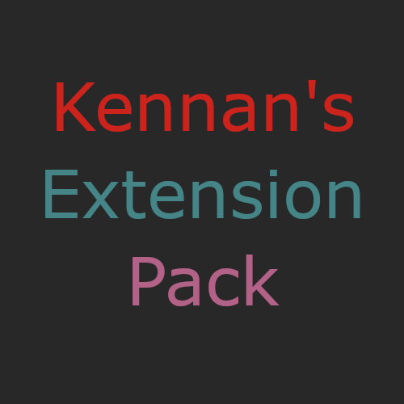

  

# Kennan's Extension Pack

[Visual Studio Code Marketplace](https://marketplace.visualstudio.com/manage/publishers/kennanhunter/extensions/kennans-extension-pack/hub)

## Extensions

- [Better Comments](https://marketplace.visualstudio.com/items?itemName=aaron-bond.better-comments)
- [Code Spell Checker](https://marketplace.visualstudio.com/items?itemName=streetsidesoftware.code-spell-checker)
- [Discord Rich Presence](https://marketplace.visualstudio.com/items?itemName=icrawl.discord-vscode)
- [Env File](https://marketplace.visualstudio.com/items?itemName=IronGeek.vscode-env)
- [Kennan's Web Snippets](https://marketplace.visualstudio.com/items?itemName=kennanhunter.kennans-web-snippets)
- [Material Icon Theme](https://marketplace.visualstudio.com/items?itemName=PKief.material-icon-theme)
- [Prettier - Code formatter](https://marketplace.visualstudio.com/items?itemName=esbenp.prettier-vscode)
- [Pretty TypeScript Errors](https://marketplace.visualstudio.com/items?itemName=yoavbls.pretty-ts-errors)
- [Rainbow CSV](https://marketplace.visualstudio.com/items?itemName=mechatroner.rainbow-csv)
- [TwoSlash Queries](https://marketplace.visualstudio.com/items?itemName=Orta.vscode-twoslash-queries)
